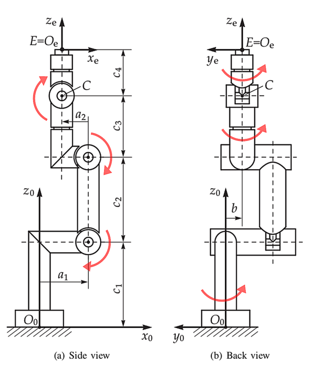

# rs-opw-kinematics

Rust implementation of inverse kinematic solutions for 6 axis industrial robots with a parallel base and spherical
wrist.

[](https://opensource.org/licenses/Apache-2.0)

# Intro

This work is based on the paper `An Analytical Solution of the Inverse Kinematics Problem
of Industrial Serial Manipulators with an Ortho-parallel Basis and a Spherical Wrist` by
Mathias Brandstötter, Arthur Angerer, and Michael Hofbaur. It is also inspired by the similar
C++ project [Jmeyer1292/opw_kinematics](https://github.com/Jmeyer1292/opw_kinematics) (used as a reference
implementation to generate data for the the test suite) but is not a direct clone of it.
Not just the code has been rewritten in Rust: there are some differences and extensions.

# Parameters

This library makes use of 7 kinematic parameters (a1, a2, b, c1, c2, c3, and c4) defined in the
paper `An Analytical Solution of the Inverse Kinematics Problem
of Industrial Serial Manipulators with an Ortho-parallel Basis and a Spherical Wrist`.

This paper assumes that the arm is at zero when all joints are sticking straight up in the air as seen in the image
below. It also assumes that all rotations are positive about the base axis of the robot. No other setup is required.



To use the library, fill out an `opw_kinematics::Parameters` data structure with the appropriate values for the 7
kinematic parameters and any joint offsets required to bring the paper's zero position (arm up in Z) to the
manufacturers position. Additionally, there are 6 "sign correction" parameters (-1 or 1) that should be specified if
your robot's axes do not match the convention in the paper.

For example, the ABB IRB2400 has the following values:

```Rust
let parameters = Parameters {
    a1: 0.100,
    a2: - 0.135,
    b: 0.000,
    c1: 0.615,
    c2: 0.705,
    c3: 0.755,
    c4: 0.085,
    offsets: [0.0, 0.0, -std::f64::consts::PI / 2.0, 0.0, 0.0, 0.0],
    sign_corrections: [1; 6],
}
``` 

Note that the offset of the third joint is -90 degrees, bringing the joint from the upright position to parallel with
the ground at "zero".

The project already contains definitions for ABB IRB 2400/10, KUKA KR 6 R700 sixx, Fanuc R-2000iB/200R, Stäubli TX40,
ABB IRB 2600-12/1.65, ABB IRB 4600-60/2.05, Stäubli TX2-140, Stäubli TX2-160, Stäubli TX2-160L with various level of
testing. 

# Example

```Rust
    fn test_no_singularity() {
    let robot = OPWKinematics::new(Parameters::irb2400_10());
    let joints = [0.0, 0.1, 0.2, 0.3, 0.4, PI];
    assert_eq!(robot.kinematic_singularity(&joints), None);
}

```

# Notes

