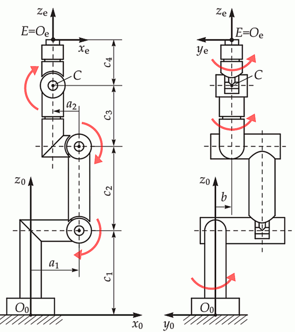

Rust implementation of inverse and forward kinematic solutions for six-axis industrial robots with a parallel base
and spherical wrist. Hardened against the J5 = 0&deg; or &plusmn; 180&deg; singularity and optimized for trajectory
planning.

[](https://github.com/bourumir-wyngs/rs-opw-kinematics)
[](https://crates.io/crates/rs-opw-kinematics)
[](https://github.com/bourumir-wyngs/rs-opw-kinematics/actions)
[](https://crates.io/crates/rs-opw-kinematics)
[](https://crates.io/crates/rs-opw-kinematics)
[](https://docs.rs/rs-opw-kinematics)

# Intro

This work builds upon the 2014 paper titled _An Analytical Solution of the Inverse Kinematics Problem of Industrial
Serial Manipulators with an Ortho-parallel Basis and a Spherical Wrist_, authored by Mathias Brandstötter, Arthur
Angerer, and Michael Hofbaur. The paper
is [available in ResearchGate](https://www.researchgate.net/profile/Mathias-Brandstoetter/publication/264212870_An_Analytical_Solution_of_the_Inverse_Kinematics_Problem_of_Industrial_Serial_Manipulators_with_an_Ortho-parallel_Basis_and_a_Spherical_Wrist/links/53d2417e0cf2a7fbb2e98b09/An-Analytical-Solution-of-the-Inverse-Kinematics-Problem-of-Industrial-Serial-Manipulators-with-an-Ortho-parallel-Basis-and-a-Spherical-Wrist.pdf)
. Additionally, it draws inspiration from the similar C++
project, [Jmeyer1292/opw_kinematics](https://github.com/Jmeyer1292/opw_kinematics), which served as a reference
implementation for generating data for the test suite.
This documentation also incorporates the robot diagram from that project.

# Features

- rs-opw-kinematics is written entirely in Rust (not a C++ binding) and deployable via Cargo.
- All returned solutions are valid, normalized, and cross-checked with forward kinematics.
- Joint angles can be checked against constraints, ensuring only compliant solutions are returned.
- To generate a trajectory of the robot (sequence of poses), it is possible to use "previous joint positions" as
  additional input.
- If the previous joint positions are provided, the solutions are sorted by proximity to them (closest first).
  It is also possible to prioritize proximity to the center of constraints.
- For kinematic singularity at J5 = 0&deg; or J5 = &plusmn;180&deg; positions this solver provides reasonable J4 and J6
  values close to the previous positions of these joints (and not arbitrary that may result in a large jerk of the real
  robot)
- Jacobian, torgues and velocities
- The robot can be equipped with the tool and placed on the base, planning for the desired location and orientation
  of the tool center point (TCP) rather than any part of the robot.
- 5 DOF inverse kinematics.
- Experimental support for parameter extraction from URDF (for 5 DOF robot, specify the tool center point as joint 6)

The solver currently uses 64-bit floats (Rust f64), providing the positional accuracy below 1&micro;m for the two
robots tested.

# Parameters

This library uses seven kinematic parameters (_a1, a2, b, c1, c2, c3_, and _c4_). This solver assumes that the arm is
at zero when all joints stick straight up in the air, as seen in the image below. It also assumes that all
rotations are positive about the base axis of the robot. No other setup is required.


<!--  -->

To use the library, fill out an `opw_kinematics::Parameters` data structure with the appropriate values for the 7
kinematic parameters and any joint offsets required to bring the paper's zero position (arm up in Z) to the
manufacturer's position. Additionally, there are 6 "sign correction" parameters (-1 or 1) that should be specified if
your robot's axes do not match the convention in the paper.

For example, the ABB IRB2400 has the following values:

```Rust
let parameters = Parameters {
a1: 0.100, a2: - 0.135, b: 0.000, c1: 0.615, c2: 0.705, c3: 0.755, c4: 0.085,
offsets: [0.0, 0.0, -std::f64::consts::PI / 2.0, 0.0, 0.0, 0.0],
sign_corrections: [1; 6],
}
``` 

Note that the offset of the third joint is -90&deg;, bringing the joint from the upright position to parallel with
the ground at "zero."

# Constraints

Since 1.1.0, it is possible to
set [constraints](https://docs.rs/rs-opw-kinematics/1.5.0/rs_opw_kinematics/constraints/index.html) for the joints.
Robot poses where any of the joints are outside
the specified constraint range are not included into returned list of solutions. It is also possible to
influence the sorting of the result list by giving some preference to the center of constraints.

Constraints are specified by providing two angles, _from_ and to, for every _joint_. If _from_ < _to_, the valid range
spans between from and to. If _from_ > _to_, the valid range spans over the 0&deg;, wrapping around. For instance,
if _from_ = 5&deg; and _to_ = 15&deg;, values 6&deg;, 8&deg;, and 11&deg; are valid, while values like 90&deg;, and
180&deg; are not. If _from_ = 15&deg; and _to_ = 5&deg; (the opposite), values 16&deg;, 17&deg;, 100&deg;, 180&deg;,
359&deg;, 0&deg;, 1&deg;, 3&deg;, 4&deg; are valid, while 6&deg;, 8&deg;, and 11&deg; are not.

Constraints are tested for the range from -2&pi; to 2&pi;, but as angles repeat with period of 2&pi;, the
constraint from -&pi; to &pi; already permits free rotation, covering any angle.

# Jacobian: torgues and velocities

Since 1.3.2, it is possible to obtain
the [Jacobian](https://docs.rs/rs-opw-kinematics/1.5.0/rs_opw_kinematics/jacobian/struct.Jacobian.html) that represents
the relationship between the joint velocities
and the end-effector velocities. The computed Jacobian object provides:

-

Joint [velocities](https://docs.rs/rs-opw-kinematics/1.5.0/rs_opw_kinematics/jacobian/struct.Jacobian.html#method.velocities)
required to achieve a desired end-effector velocity.

-

Joint [torques](https://docs.rs/rs-opw-kinematics/1.5.0/rs_opw_kinematics/jacobian/struct.Jacobian.html#method.torques)
required to achieve a desired end-effector force/torque.

The same Joints structure is reused, the six values now representing either angular velocities in radians per second
or torgues in Newton meters. For the end effector, it is possible to use either
nalgebra::[Isometry3](https://docs.rs/nalgebra/latest/nalgebra/geometry/type.Isometry3.html)
or [Vector6](https://docs.rs/nalgebra/latest/nalgebra/base/type.Vector6.html), both defining velocities in m/s or
rotations in N m.

These values are useful when path planning for a robot that needs to move very swiftly, to prevent
overspeed or overtorgue of individual joints.

# The tool and the base

Since 1.3.2, robot can be equipped with
the [tool](https://docs.rs/rs-opw-kinematics/1.5.0/rs_opw_kinematics/tool/struct.Tool.html), defined as
nalgebra::[Isometry3](https://docs.rs/nalgebra/latest/nalgebra/geometry/type.Isometry3.html). The tool isometry defines
both
additional translation and additional rotation. The "pose" as defined in forward and inverse kinematics
now becomes the pose of the tool center point, not any part of the robot. The robot can also be placed
on a [base](https://docs.rs/rs-opw-kinematics/1.5.0/rs_opw_kinematics/tool/struct.Base.html), further supporting the
conditions much closer to the real industrial environment.

"Robot with the tool" and "Robot on the base" can be constructed around
any [Kinematics](https://docs.rs/rs-opw-kinematics/1.5.0/rs_opw_kinematics/kinematic_traits/trait.Kinematics.html)
trait, and implement
this trait themselves. It is possible to cascade them, constructing a robot on a base and with the tool (or
two tools if the first is a receptacle of the tool changer).

# The frame

Since 1.5.0 this package supports the frame transform that allows to transform the robot trajectory (in terms of joint
angles)
prepared for one location to make the same kind of movements in another location (translated and rotated).
Frame in robotics is most commonly defined by the 3 pairs of points (to and from) if the transform includes
also rotation, or just a single pair is enough if only shift (but not a rotation) is involved.

Once constructed by specifying original and transformed points, the Frame object can take "canonical" joint angles
and calculated joint angles for the transformed (shifted and rotated) trajector. See the
[frame](https://docs.rs/rs-opw-kinematics/1.5.0/rs_opw_kinematics/frame/index.html) documentation for details.

# 5 DOF inverse kinematics

For tools that are not sensitive to axis rotation (such as welding torches or paint sprayers), inverse kinematics can be
requested where the value of joint 6 (which typically controls this rotation) is either inherited from the previous
position or explicitly specified.

Support for 5 DOF robots is now included through an additional 'dof' field in the
parameter data structure. 5 DOF inverse kinematics can also be requested for 6 DOF
robots, particularly when the last joint is in constant motion (e.g., for drilling), or when maintaining precise tool
rotation would cause the robot to exceed its constraints. This method is also faster to compute. If the robot is
flagged as 5 DOF robot, the value of the joint 6 will normally be 0 and ignored.

# Example

Cargo.toml:

```toml
[dependencies]
rs-opw-kinematics = ">=1.5.0, <2.0.0" 
```

main.rs:

```Rust
use std::f64::consts::PI;
use std::sync::Arc;
use nalgebra::{Isometry3, Translation3, UnitQuaternion, Vector3};
use rs_opw_kinematics::kinematic_traits::{Joints, Kinematics, Pose,
                                          JOINTS_AT_ZERO, CONSTRAINT_CENTERED};
use rs_opw_kinematics::kinematics_impl::OPWKinematics;
use rs_opw_kinematics::parameters::opw_kinematics::Parameters;
use rs_opw_kinematics::utils::{dump_joints, dump_solutions};
use rs_opw_kinematics::constraints::{BY_CONSTRAINS, BY_PREV, Constraints};

fn main() {
    let robot = OPWKinematics::new(Parameters::irb2400_10());
    let joints: Joints = [0.0, 0.1, 0.2, 0.3, 0.0, 0.5]; // Joints are alias of [f64; 6]
    println!("Initial joints with singularity J5 = 0: ");
    dump_joints(&joints);

    println!("Solutions (original angle set is lacking due singularity there: ");
    let pose: Pose = robot.forward(&joints); // Pose is alias of nalgebra::Isometry3<f64>

    let solutions = robot.inverse(&pose); // Solutions is alias of Vec<Joints>
    dump_solutions(&solutions);

    println!("Solutions assuming we continue from somewhere close. The 'lost solution' returns");
    let when_continuing_from: [f64; 6] = [0.0, 0.11, 0.22, 0.3, 0.1, 0.5];
    let solutions = robot.inverse_continuing(&pose, &when_continuing_from);
    dump_solutions(&solutions);

    println!("Same pose, all J4+J6 rotation assumed to be previously concentrated on J4 only");
    let when_continuing_from_j6_0: [f64; 6] = [0.0, 0.11, 0.22, 0.8, 0.1, 0.0];
    let solutions = robot.inverse_continuing(&pose, &when_continuing_from_j6_0);
    dump_solutions(&solutions);

    println!("If we do not have the previous position, we can assume we want J4, J6 close to 0.0 \
    The solution appears and the needed rotation is now equally distributed between J4 and J6.");
    let solutions = robot.inverse_continuing(&pose, &JOINTS_AT_ZERO);
    dump_solutions(&solutions);

    let robot = OPWKinematics::new_with_constraints(
        Parameters::irb2400_10(), Constraints::new(
            [-0.1, 0.0, 0.0, 0.0, -PI, -PI],
            [PI, PI, 2.0 * PI, PI, PI, PI],
            BY_PREV,
        ));

    println!("If we do not have the previous pose yet, we can now ask to prever the pose \
    closer to the center of constraints.");
    let solutions = robot.inverse_continuing(&pose, &CONSTRAINT_CENTERED);
    dump_solutions(&solutions);


    println!("With constraints, sorted by proximity to the previous pose");
    let solutions = robot.inverse_continuing(&pose, &when_continuing_from_j6_0);
    dump_solutions(&solutions);

    let robot = OPWKinematics::new_with_constraints(
        Parameters::irb2400_10(), Constraints::new(
            [-0.1, 0.0, 0.0, 0.0, -PI, -PI],
            [PI, PI, 2.0 * PI, PI, PI, PI],
            BY_CONSTRAINS,
        ));
    println!("With constraints, sorted by proximity to the center of constraints");
    let solutions = robot.inverse_continuing(&pose, &when_continuing_from_j6_0);
    dump_solutions(&solutions);

    // This requires YAML library
    let parameters = Parameters::irb2400_10();
    println!("Reading:\n{}", &parameters.to_yaml());

    // Jacobian, velocities and forces:
    let jakobian = rs_opw_kinematics::jakobian::Jacobian::new(&robot, &joints, 1E-6);
    let desired_velocity_isometry =
        Isometry3::new(Vector3::new(0.0, 1.0, 0.0),
                       Vector3::new(0.0, 0.0, 1.0));
    let joint_velocities = jakobian.velocities(&desired_velocity_isometry);
    println!("Computed joint velocities: {:?}", joint_velocities.unwrap());

    let desired_force_torque =
        Isometry3::new(Vector3::new(0.0, 0.0, 0.0),
                       Vector3::new(0.0, 0.0, 1.234));

    let joint_torques = jakobian.torques(&desired_force_torque);
    println!("Computed joint torques: {:?}", joint_torques);

    // Robot with the tool, standing on a base:
    let robot_alone = OPWKinematics::new(Parameters::staubli_tx2_160l());

    // Half meter high pedestal
    let pedestal = 0.5;
    let base_translation = Isometry3::from_parts(
        Translation3::new(0.0, 0.0, pedestal).into(),
        UnitQuaternion::identity(),
    );

    let robot_with_base = rs_opw_kinematics::tool::Base {
        robot: Arc::new(robot_alone),
        base: base_translation,
    };

    // Tool extends 1 meter in the Z direction, envisioning something like sword
    let sword = 1.0;
    let tool_translation = Isometry3::from_parts(
        Translation3::new(0.0, 0.0, sword).into(),
        UnitQuaternion::identity(),
    );

    // Create the Tool instance with the transformation
    let robot_complete = rs_opw_kinematics::tool::Tool {
        robot: Arc::new(robot_with_base),
        tool: tool_translation,
    };

    let tcp_pose: Pose = robot_complete.forward(&joints);
    println!("The sword tip is at: {:?}", tcp_pose);
}
```

The constants _BY_PREV_ ( = 0.0) and _BY_CONSTRAINTS_ ( = 1.0) are for convenience only. Intermediate values like
0.6 can also be specified and result in weighted sorting.

# Configuring the solver for your robot

The project contains built-in definitions for ABB IRB 2400/10, IRB 2600-12/1.65, IRB 4600-60/2.05; KUKA KR 6 R700 sixx,
FANUC R-2000iB/200R; Stäubli TX40, TX2-140, TX2-160 and TX2-160L with various levels of
testing. Robot manufacturers may provide such configurations for the robots they make.
For instance, FANUC M10IA is
described [here](https://github.com/ros-industrial/fanuc/blob/3ea2842baca3184cc621071b785cbf0c588a4046/fanuc_m10ia_support/config/opw_parameters_m10ia.yaml).
Many other robots are described in [ros-industrial/fanuc](https://github.com/ros-industrial/fanuc) repository.
This project contains the code for reading such configurations directly, including support for *deg(angle)*
function that sometimes occurs there:

```Rust
  let parameters = Parameters::from_yaml_file(filename).expect("Failed to load parameters");
println!("Reading:\n{}", &parameters.to_yaml());
let robot = OPWKinematics::new(parameters);
```

Since version 1.2.0, parameters and constraints can also be directly extracted from URDF file:

```Rust
  let robot = rs_opw_kinematics::urdf::from_urdf_file("/path/to/robot.urdf");
println!("Reading:\n{}", &parameters.to_yaml());
```

There is also more advanced
function [rs_opw_kinematics::urdf::from_urdf](https://docs.rs/rs-opw-kinematics/1.5.0/rs_opw_kinematics/urdf/fn.from_urdf.html)
that takes URDF string rather than the file, provides error handling and much more control over how the solver
is constructed from the extracted values.

YAML reader supports additional 'dof' field that can be set to 6 (default) or 5 (5DOF robot, tool rotation 
not accounted for). The URDF reader has als been extended to support such robots, but joint names must aways be 
explicitly provided. Instead of specifying a name for joint 6, the name of the tool center point (TCP) must be given.
Both YAML and URDF readers still try to obtain the parameter c4 that is now distance from J5 axis till TCP.

**Important:** The URDF reader assumes a robot with parallel base and spherical wrist and not an arbitrary robot.
You can easily check this in the robot documentation or simply looking into the drawing. If the robot appears OPW
compliant yet parameters are not extracted correctly, please submit a bug report, providing URDF file and expected
values. In general, always test in simulator before feeding the output of any software to the physical robot.

# Disabling YAML and URDF readers

For security and performance, some users prefer smaller libraries with less dependencies. If YAML and URDF readers
are not in use, the filesystem access can be completely disabled in your Cargo.toml, importing the library like:

rs-opw-kinematics = { version = ">=1.5.0, <2.0.0", default-features = false }

In this case, import of URDF and YAML files will be unaccessible, and used dependencies
will be limited to the single _nalgebra_ crate.

# Testing

The code of this project is tested against the test set (cases.yaml, 2048 cases per robot) that is
believed to be correct for the two robots, KUKA KR 6 R700 sixx and ABB IRB 2400/10. It has been produced
using independent C++ implementation by [Jmeyer1292/opw_kinematics](https://github.com/Jmeyer1292/opw_kinematics). The
testing suite checks if the solutions
match.


