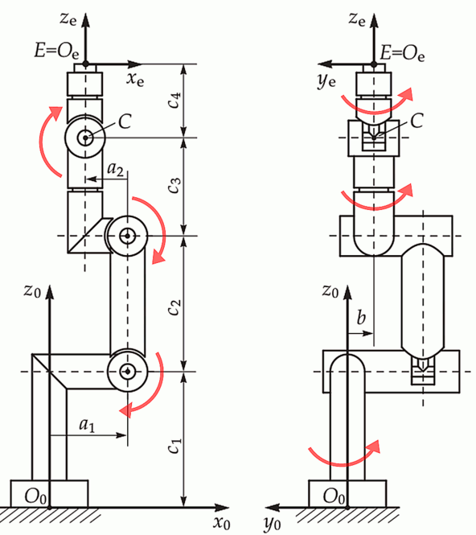

Rust implementation of inverse and forward kinematic solutions for six-axis industrial robots with a parallel base
and spherical wrist. Hardened against the J5 = 0&deg; or &plusmn;180&deg; singularity and optimized for trajectory
planning.

[](https://github.com/bourumir-wyngs/rs-opw-kinematics)
[](https://crates.io/crates/rs-opw-kinematics)
[](https://github.com/bourumir-wyngs/rs-opw-kinematics/actions)
[](https://crates.io/crates/rs-opw-kinematics)
[](https://crates.io/crates/rs-opw-kinematics)
[](https://docs.rs/rs-opw-kinematics)


This library is also available from Python via [spherical-wrist](https://github.com/bourumir-wyngs/spherical-wrist) crate.

See also [video produced with RViz under ROS2](https://www.youtube.com/watch?v=CVZ9CFt_QMM)

# Intro

This work builds upon the 2014 paper titled _An Analytical Solution of the Inverse Kinematics Problem of Industrial
Serial Manipulators with an Ortho-parallel Basis and a Spherical Wrist_, authored by Mathias Brandstötter, Arthur
Angerer, and Michael Hofbaur. The paper is [available on ResearchGate](https://www.researchgate.net/profile/Mathias-Brandstoetter/publication/264212870_An_Analytical_Solution_of_the_Inverse_Kinematics_Problem_of_Industrial_Serial_Manipulators_with_an_Ortho-parallel_Basis_and_a_Spherical_Wrist/links/53d2417e0cf2a7fbb2e98b09/An-Analytical-Solution-of-the-Inverse-Kinematics-Problem-of-Industrial-Serial-Manipulators-with-an-Ortho-parallel-Basis-and-a-Spherical-Wrist.pdf). Additionally, it draws inspiration from
the similar C++ project, [Jmeyer1292/opw_kinematics](https://github.com/Jmeyer1292/opw_kinematics), which served as a reference implementation for generating
data for the test suite. This documentation also incorporates the robot diagram from that project.

# Features

- rs-opw-kinematics is written entirely in Rust (not a C++ binding) and deployable via Cargo.
- Inverse solutions are cross-checked with forward kinematics: the full pose for 6 DOF,
  and the tool position for 5 DOF. Continuation normalizes joint angles near the previous values.
- Joint angles can be checked against constraints, ensuring only compliant solutions are returned.
- Collision detection (with [Parry](https://parry.rs/)) allows excluding solutions where the robot would collide with
  itself or environment objects. It is possible to configure minimum clearances between surfaces rather than
  just checking if they touch.
- For the kinematic singularity at J5 = 0&deg; or J5 = &plusmn;180&deg; positions, this solver provides reasonable J4 and J6
  values close to the previous positions of these joints (and not arbitrary that may result in a large jerk on the real
  robot). Since 1.8.10, the "previous" rotation can be in a wide range well outside &plusmn;360&deg;.
- The robot can be equipped with the tool and placed on the base, planning for the desired location and orientation
  of the tool center point (TCP) rather than any specific link of the robot.
- Cartesian stroke planning with joint-transition limits, sampled collision checks,
  and RRT connections from the starting configuration.
- Jacobian, torques, and velocities
- 5 DOF inverse kinematics.
- Optional visualization (with [Bevy](https://bevyengine.org/)) helps check robot configuration;
  enable it with the `visualization` feature.

The solver uses 64-bit floats (Rust `f64`). Inverse-pose validation accepts position errors
up to one millionth of the sum of the absolute OPW geometry parameters and, for 6 DOF,
orientation errors up to `1e-6` radians.

# Quick example

Cargo.toml:

```toml
[dependencies]
rs-opw-kinematics = "3"
```

Simple "hello world" demonstrating singularity handling:

```rust
use rs_opw_kinematics::kinematic_traits::{Joints, Kinematics};
use rs_opw_kinematics::kinematics_impl::OPWKinematics;
use rs_opw_kinematics::parameters::opw_kinematics::Parameters;
use rs_opw_kinematics::utils::{dump_joints, dump_solutions};

fn main() {
    // Create a robot with a built-in parameter set. Plain kinematics; no collision checks.
    let robot = OPWKinematics::new(Parameters::irb2400_10());

    // Joints are an alias of [f64; 6], given in radians here.
    let joints: Joints = [0.0, 0.1, 0.2, 0.3, 0.0, 0.5];

    println!("\nInitial joints with singularity J5 = 0:");
    dump_joints(&joints);

    // Get the pose produced by the joint configuration above.
    let pose = robot.forward(&joints);

    println!("\nSolutions near the previous joint configuration:");
    // Previous joint configuration used to select consistent J4/J6 at the J5 singularity.
    let when_continuing_from: Joints = [0.0, 0.11, 0.22, 0.3, 0.1, 0.5];

    let solutions = robot.inverse_continuing(&pose, &when_continuing_from);
    dump_solutions(&solutions);
}
```

Since version 1.8.10, the "previous" angles can be very large (including negative values). Test cases cover angles up to 90,000 degrees.

For 6 DOF, both `inverse` and `inverse_continuing` recover wrist singularities without
shifting the requested Cartesian position. In OPW model coordinates, after applying
joint signs and offsets, the target fixes J4 + J6 at J5 = 0° and J4 - J6 at J5 = ±180°.
Continuation splits the required correction equally between J4 and J6,
using the previous values as a reference. Those values may need to change to reach the
target pose. Plain `inverse` uses constraint centers, or zeros when unconstrained.
Small, resolvable nonzero J5 bends retain their individual wrist angles.

For 5 DOF, J6 stays fixed and J4 is free at a wrist pole. When constraints are
present, the J4 choice follows their `sorting_weight`, balancing distance from
the previous angle and the constraint center. Tied scores favor the previous angle.

See [Supported singularities](#supported-singularities) for the arm and wrist cases handled by the solver.

The project rs-opw-kinematics has now evolved beyond being just a set of "useful building blocks." It now
enables the creation of a complete robot setup, which includes mounting the robot on a base, equipping it with a tool,
integrating collision checking and both joint-based and Cartesian path planning with collision avoidance.
See example [complete_visible_robot.rs](examples/complete_visible_robot.rs).

## Parameters

This library uses seven kinematic parameters (_a1, a2, b, c1, c2, c3_, and _c4_). This solver assumes that the arm is
at zero when all joints stick straight up in the air, as seen in the image below. Positive
rotations follow the right-hand rule about each joint's own axis; sign corrections adapt
this convention to the robot's joint directions.




To use the library, fill out an `opw_kinematics::Parameters` data structure with the appropriate values for the 7
kinematic parameters and any joint offsets required to bring the paper's zero position (arm up in Z) to the
manufacturer's position. Additionally, there are 6 "sign correction" parameters (-1 or 1) that should be specified if
your robot's axes do not match the convention in the paper.

Joint offsets must be finite and within ±2π radians (±360°), inclusive.
Solver construction panics if any offset is outside this range or non-finite.

For example, the ABB IRB2400 has the following values:

```rust
use rs_opw_kinematics::parameters::opw_kinematics::Parameters;

let parameters = Parameters {
    a1: 0.100, a2: -0.135, b: 0.000, c1: 0.615, c2: 0.705, c3: 0.755, c4: 0.085,
    offsets: [0.0, 0.0, -std::f64::consts::PI / 2.0, 0.0, 0.0, 0.0],
    sign_corrections: [1; 6],
    dof: 6,
};
``` 

Note that the offset of the third joint is -90&deg;, bringing the joint from the upright position to parallel with
the ground at "zero."

If you have the OPW robot and not sure how to configure it for this tool, contact
<a href="mailto:&#98;&#111;&#117;&#114;&#117;&#109;&#105;&#114;&#46;&#119;&#121;&#110;&#103;&#115;&#64;&#103;&#109;&#97;&#105;&#108;&#46;&#99;&#111;&#109;">&#98;&#111;&#117;&#114;&#117;&#109;&#105;&#114;&#46;&#119;&#121;&#110;&#103;&#115;&#64;&#103;&#109;&#97;&#105;&#108;&#46;&#99;&#111;&#109;</a> and we will help with integration.

## Constraints

Since 1.1.0, it is possible to
set [constraints](https://docs.rs/rs-opw-kinematics/latest/rs_opw_kinematics/constraints/index.html) for the joints.
Robot poses where any of the joints are outside
the specified constraint range are not included in the returned list of solutions. It is also possible to
influence the sorting of the result list by giving some preference to the center of constraints.

Constraints are specified by providing two angles, _from_ and to, for every _joint_. If _from_ < _to_, the valid range
spans between from and to. If _from_ > _to_, the valid range spans over the 0&deg;, wrapping around. For instance,
if _from_ = 5&deg; and _to_ = 15&deg;, values 6&deg;, 8&deg;, and 11&deg; are valid, while values like 90&deg;, and
180&deg; are not. If _from_ = 15&deg; and _to_ = 5&deg; (the opposite), values 16&deg;, 17&deg;, 100&deg;, 180&deg;,
359&deg;, 0&deg;, 1&deg;, 3&deg;, 4&deg; are valid, while 6&deg;, 8&deg;, and 11&deg; are not.

Constraints are tested for the range from -2&pi; to 2&pi;, but as angles repeat with the period of 2&pi;, the
constraint from -&pi; to &pi; already permits free rotation, covering any angle.

Since 1.8.2, convenience method exists to specify constraints as ranges in degrees.

Please see the [example](examples/constraints.rs).

## Supported singularities

1. Free base rotation (J1). With `b = 0` and the wrist center on the base rotation axis,
   the position equations cannot determine J1. The solver searches J1 while keeping J2
   and J3 fixed for each arm branch, then recovers compatible wrist angles. The built-in
   Stäubli TX2-140 is tested at such a pose; ABB IRB2400 geometry also permits this case.

2. Free shoulder rotation (J2). When `c2² = a2² + c3²`, the arm can fold completely at
   model `J3 = π - atan2(a2, c3)`. The wrist center returns to the shoulder rotation axis,
   so J2 can vary while J1 and J3 stay fixed. The solver searches this family for
   candidates compatible with wrist orientation and joint limits. Both Stäubli TX2-140
   and TX40 presets have the required equal effective arm lengths.

3. J1 and J2 free together. A fully folded arm with `c2² = a2² + c3²`,
   `a1 = 0`, and `b = 0` places the wrist center at the shoulder on the base axis. Both J1 and J2
   can vary while J3 remains folded. The solver selects J1 slices and searches J2
   within each slice, using wrist-limit boundaries to locate feasible regions.
   Tests use a TX2-140-based geometry with `a1` changed to zero; no unchanged built-in
   preset currently has this combination.

4. Fully extended or folded elbow. At model `J3 = -atan2(a2, c3)` or
   `J3 = π - atan2(a2, c3)`, the effective arm links are parallel or antiparallel
   and elbow branches merge at the outer or inner reach boundary. The inverse equations
   retain reachable boundary solutions despite arithmetic roundoff. With unequal
   effective lengths, J2 remains determined at the folded boundary. Tests cover both
   boundaries with the ABB IRB2400 preset.

5. Shoulder-cylinder boundary. With a nonzero lateral offset `b`, the wrist center
   can lie exactly `abs(b)` from the base axis. The two shoulder branches meet at this
   boundary, but J1 remains determined. The solver handles the square-root boundary
   with a roundoff allowance. Tests cover the Stäubli TX40 and cases where shoulder
   and elbow boundaries occur together.

6. Wrist joint J5 = 0°. The J4 and J6 axes align, and the target orientation fixes
   only their sum, `J4 + J6`. The solver recovers this phase and chooses a coupled pair
   near the reference. Without joint limits, the required phase correction is split
   equally between J4 and J6. With limits, it selects a possible pair according to the
   configured preference for previous angles and constraint centers.

7. Wrist joint at J5 = 180°. The wrist is reversed, so the target fixes the difference,
   `J4 - J6`. Recovery follows the same approach as the zero pole, but the phase correction
   moves J4 and J6 in opposite directions. 

Arm and wrist singularities can occur together. 

## Pose

The public kinematics API uses a crate-owned
[Pose](https://docs.rs/rs-opw-kinematics/latest/rs_opw_kinematics/pose/struct.Pose.html)
type backed by `rs_opw_kinematics::glam::DVec3` translation and `rs_opw_kinematics::glam::DQuat` rotation. Forward kinematics returns this pose,
and inverse kinematics accepts the same type.
`Pose::from_parts` normalizes the rotation. The `translation` and `rotation` fields are public for
direct access, but callers that mutate `pose.rotation` directly must keep it as a finite, normalized
quaternion. Use the `rs_opw_kinematics::glam` re-export in downstream code so your vector and quaternion types match the crate API.

```rust
use rs_opw_kinematics::glam::{DQuat, DVec3};
use rs_opw_kinematics::kinematic_traits::Pose;

let pose = Pose::from_parts(
    DVec3::new(0.4, 0.2, 0.8),
    DQuat::from_rotation_z(90.0_f64.to_radians()),
);

println!("TCP z = {:.3}", pose.translation.z);
```

## Migrating to 3.0

- Visualization is now opt-in. Enable `features = ["visualization"]` in your
  dependency or pass `--features visualization` when running graphical examples.
- Geometry and visualization now share `glam` 0.32.1 with Bevy 0.19 and
  Parry 0.27. Prefer `rs_opw_kinematics::glam` imports; if you depend on
  `glam` directly, use `glam = "0.32.1"`.
- Remove uses of `kinematic_traits::Singularity` and
  `Kinematics::kinematic_singularity`, including this method in custom trait
  implementations. Wrist singularities are handled inside the inverse solver.
- Remove the legacy `yaml-rust2` feature from dependency declarations. YAML loading
  is provided by `allow_filesystem`, which remains enabled by default.
- Replace `read_trimesh::load_trimesh_from_ply(path)` and
  `read_trimesh::load_trimesh_from_stl(path)` with
  `rs_read_trimesh::load_trimesh(path, 1.0)` and handle its `Result`.
  Add `rs-read-trimesh` as a direct dependency with the matching Parry backend:

```toml
rs-read-trimesh = { version = "=2.0.10", default-features = false, features = ["use-parry-27"] }
```

See [CHANGELOG.md](CHANGELOG.md) for the full list of changes.

## Migrating to 2.0

Version 2.0 makes the geometry API glam-native and removes nalgebra from this
crate's public API and direct dependencies. See also
[RELEASE_NOTES_2.0.md](RELEASE_NOTES_2.0.md).
The dependency versions in this section describe the 2.0 migration; for 3.0,
use the versions in [Migrating to 3.0](#migrating-to-30).

- Replace nalgebra `Isometry3`, `Translation3`, and `UnitQuaternion` poses with
  crate-owned `Pose` values created by `Pose::from_translation` or
  `Pose::from_parts(DVec3, DQuat)`.
- Import glam types from `rs_opw_kinematics::glam`, for example
  `use rs_opw_kinematics::glam::{DQuat, DVec3, Quat, Vec3};`. If downstream
  code imports `glam` directly, depend on the exact compatible version:
  `glam = "=0.30.10"`.
- Use `pose.translation` and `pose.rotation` directly instead of nalgebra
  isometry fields.
- Use `Pose32` for collision and visualization placement, including
  `CollisionBody::pose`, `BaseBody::base_pose`, and `PositionedJoint::transform`.
- `KinematicsWithShape::new` and `KinematicsWithShape::with_safety` take
  `Pose` for base and tool transforms.
- Jacobian velocity and torque APIs use `Twist` and `Wrench`; six-component
  helper methods accept `Joints`.
- Parry is upgraded to `parry3d` 0.26, and mesh loading uses
  `rs-read-trimesh` 2.0.9 with its default Parry 0.26 support.
- Replace the old `rrt` feature with `stroke_planning`. The compatibility
  feature stubs `ply-rs-bw` and `stl_io` were removed; use `rs-read-trimesh` or
  `allow_filesystem` for mesh/file loading support.
- Direct `Cartesian` construction now requires the additional configuration
  fields `allow_reconfigure`, `max_reconfiguration_prefix_candidates`,
  `preferred_onboarding_suffix_candidates`, `max_cartesian_layer_states`, and
  `max_solutions_await`. Use the exported `DEFAULT_*` constants or `0` where
  documented to select crate defaults.
- `RRTPlanner` gained `smooth`; set it to `0` to keep raw RRT paths without
  shortcut smoothing.
- `AnnotatedJoints` gained `move_into`. Use it to distinguish Cartesian motion
  from joint-space motion into each waypoint.
- `PathFlags::ALTERED` and `PathFlags::CARTESIAN` were removed. Reconfiguration
  is now represented by `PathFlags::RECONFIGURING`, and joint-space
  reconfiguration waypoints have `move_into == MoveKind::Joint`. Cartesian
  waypoints have `move_into == MoveKind::Cartesian`.
- Downstream code that still needs nalgebra should add its own nalgebra
  dependency and keep conversions at the application boundary.

## Jacobian: torques and velocities

Since 1.3.2, it is possible to obtain
the [Jacobian](https://docs.rs/rs-opw-kinematics/latest/rs_opw_kinematics/jacobian/struct.Jacobian.html) that represents
the relationship between the joint velocities
and the end-effector velocities. The computed Jacobian object provides:

- Joint [velocities](https://docs.rs/rs-opw-kinematics/latest/rs_opw_kinematics/jacobian/struct.Jacobian.html#method.velocities) required to achieve a desired end-effector velocity.
- Joint [torques](https://docs.rs/rs-opw-kinematics/latest/rs_opw_kinematics/jacobian/struct.Jacobian.html#method.torques) required to achieve a desired end-effector force/torque.

The same Joints structure is reused, the six values now representing either angular velocities in radians per second
or torques in Newton meters. End-effector velocity is represented as
[`Twist`](https://docs.rs/rs-opw-kinematics/latest/rs_opw_kinematics/pose/struct.Twist.html):
linear velocity in meters per second and angular velocity in radians per second, both stored as `rs_opw_kinematics::glam::DVec3`.
End-effector force and torque are represented as
[`Wrench`](https://docs.rs/rs-opw-kinematics/latest/rs_opw_kinematics/pose/struct.Wrench.html):
force in newtons and torque in newton meters.

For callers that already store six-component arrays, `velocities_from_vector` and `torques_from_vector` accept `Joints`
with the first three components for the linear part and the last three for the angular part.

These values are useful when path planning for a robot that needs to move very swiftly, to prevent
overspeed or overtorque of individual joints.

Please see the [example](examples/jacobian.rs).

## The tool and the base

Since 1.3.2, robot can be equipped with
the [tool](https://docs.rs/rs-opw-kinematics/latest/rs_opw_kinematics/tool/struct.Tool.html), defined as a `Pose`.
The tool pose defines both additional translation and additional rotation. The "pose" as defined in forward and
inverse kinematics now becomes the pose of the tool center point, not any part of the robot. The robot can also be placed
on a [base](https://docs.rs/rs-opw-kinematics/latest/rs_opw_kinematics/tool/struct.Base.html), further supporting the conditions much closer to the real industrial environment.

```rust
use rs_opw_kinematics::glam::DVec3;
use rs_opw_kinematics::kinematic_traits::Pose;

let base = Pose::from_translation(DVec3::new(0.0, 0.0, 0.5));
let tool = Pose::from_translation(DVec3::new(0.0, 0.0, 1.0));
```

"Robot with the tool" and "Robot on the base" can be constructed around
any [Kinematics](https://docs.rs/rs-opw-kinematics/latest/rs_opw_kinematics/kinematic_traits/trait.Kinematics.html)
trait, and implement
this trait themselves. It is possible to cascade them, constructing a robot on a base and with the tool (or
two tools if the first is a receptacle of the tool changer).

Please see the [example](examples/tool_and_base.rs).

## The frame

This package supports the frame transform that allows to transform the robot trajectory (in terms of joint
angles) prepared for one location to make the same kind of movements in another location (translated, rotated, and scaled).
Frame in robotics is most commonly defined by the 3 pairs of points (to and from) if the transform includes
also rotation, or just a single pair is enough if only shift (but not a rotation) is involved.

Frame construction uses `rs_opw_kinematics::glam::DVec3` points and stores the resulting transform as
`FrameTransform`, which includes translation, rotation, and uniform scale.
`Frame::translation` and `Frame::frame` construct rigid transforms;
`Frame::try_from_tie` also supports uniform scaling. Once constructed by specifying
original and transformed points, the Frame object can take "canonical" joint angles and calculated joint angles for the
transformed (shifted and rotated) trajectory. See the [frame](https://docs.rs/rs-opw-kinematics/latest/rs_opw_kinematics/frame/index.html) documentation and [example](examples/frame.rs) for details.

## Individual link positions

It is now possible to obtain positions of individual links in forward kinematics. This would be needed for
collision avoidance and graphical rendering of the robot.
See [forward_with_joint_poses](https://docs.rs/rs-opw-kinematics/latest/rs_opw_kinematics/kinematic_traits/trait.Kinematics.html#tymethod.forward_with_joint_poses)
method.

## 5 DOF inverse kinematics

For tools that are not sensitive to axis rotation (such as welding torches or paint sprayers), inverse kinematics can be
requested where the value of joint 6 (which typically controls this rotation) is either inherited from the previous
position or explicitly specified.

The 5 DOF robot can still be represented with the same diagram, and has the same parameters. However, joint 6 is assumed
to be fixed. Such a robot still can bring the tool to the needed location, also following the generic orientation
but the rotation around the tool axis is not followed.

Use `inverse_5dof(&pose, j6)` with a finite fixed J6 angle, or
`inverse_continuing_5dof(&pose, &previous)` to retain the previous J6 angle and sort
solutions near the previous configuration. These explicit methods also apply joint constraints.
They can be used with 6 DOF models when exact tool-axis rotation is unnecessary.
The `Parameters::dof` field identifies 5 DOF models; YAML and URDF loaders lock
the sixth model joint for those robots. A manually constructed model's J6 behavior
also depends on its sign correction and offset.

For `OPWKinematics` models marked `dof = 5`, `inverse` fixes J6 at zero, while
`inverse_continuing` retains the previous J6 value. Both filter joint constraints;
continuation also normalizes angles near the previous values and sorts solutions
according to the configured preference.

## Parallelogram

The parallelogram mechanism maintains the orientation of the end-effector in
some robots. It introduces a geometric relationship between two joints,
typically referred to as the _driven joint_ (often J₂) and the _coupled joint_
(often J₃), to ensure the end-effector remains stable in its orientation during
motion.

In forward kinematics, J₃ is adjusted by subtracting the value of J₂ multiplied
by a scaling factor `s` (often 1.0). The relationship can be written as:

J₃' = J₃ - s * J₂

This adjustment maintains the correct orientation of the end-effector as the
robot moves through its workspace.

In inverse kinematics, the process is reversed. The value of J₂ is added back
to J₃, ensuring accurate joint angle calculations for achieving the desired
end-effector pose and orientation. This can be expressed as:

J₃ = J₃' + s * J₂

The scaling factor `s` determines how much influence J₂ has on J₃. A scaling
factor of 1.0 compensates the driven J₂ motion so that, with J₃ and the other
joints held fixed, moving J₂ does not change the end-effector orientation.

See [Parallelogram](https://docs.rs/rs-opw-kinematics/latest/rs_opw_kinematics/parallelogram/struct.Parallelogram.html) and [example](examples/parallelogram.rs).

## Collision avoidance
The new class
[KinematicsWithShape](https://docs.rs/rs-opw-kinematics/latest/rs_opw_kinematics/kinematics_with_shape/struct.KinematicsWithShape.html)
combines kinematics and collision checking. It implements the
[Kinematics](https://docs.rs/rs-opw-kinematics/latest/rs_opw_kinematics/kinematic_traits/trait.Kinematics.html) trait,
providing both forward and inverse kinematic solutions. During inverse kinematics, any colliding poses are excluded
from the solution list.

For collision avoidance, you need to supply meshes for robot joints and, optionally, for the base, tool,
and environment objects.

Starting with version 1.8.0, it is now possible to configure a safety distance — the minimum distance to a surface
below which a collision is detected. In most real-world scenarios, a robot must maintain a guaranteed clearance from
objects it might collide with (including its own parts) rather than simply avoiding surface contact.

If the safety distance is set to zero, collisions are still likely due to the inherent limitations in system accuracy.
Setting a zero safety distance is only advisable if the meshes are "inflated" (made larger than their actual size),
but achieving this reliably is challenging and requires careful validation. On the other hand, checking for contact
rather than maintaining a safety distance is significantly faster.

Safety distances are controlled through [SafetyDistances](https://docs.rs/rs-opw-kinematics/latest/rs_opw_kinematics/collisions/struct.SafetyDistances.html) structure as shown in the example below.

Safety distances can be configured separately for robot-to-robot and robot-to-environment collisions.
Shorter distances can be specified for joints that naturally operate in proximity.

The code below demonstrates how to create this structure, complete with tool,
base, and constraints (see also [example](examples/complete_visible_robot.rs)):

It uses the default features and loads meshes from a local checkout of this repository.
Add the mesh loader as a direct dependency:

```toml
rs-read-trimesh = { version = "=2.0.10", default-features = false, features = ["use-parry-27"] }
```

```rust
use rs_opw_kinematics::glam::{DVec3, Vec3};
use rs_opw_kinematics::constraints::{Constraints, BY_PREV};
use rs_opw_kinematics::collisions::{
    CollisionBody, SafetyDistances, CheckMode, NEVER_COLLIDES,
};
use rs_opw_kinematics::kinematic_traits::{Pose, J_BASE, J2, J3, J4, J6, J_TOOL};
use rs_opw_kinematics::kinematics_with_shape::KinematicsWithShape;
use rs_opw_kinematics::parameters::opw_kinematics::Parameters;
use rs_opw_kinematics::pose::Pose32;
use rs_read_trimesh::load_trimesh; // loads .stl, .ply, .obj and .dae. Supports scaling. 

/// Create the sample robot we will visualize. This function creates
/// Stäubli RX160, using its parameter set.
/// It loads the joint meshes from .stl files bundled in the test folder
/// where they are shared under the Apache license (ROS-Industrial project).
/// Four environment objects and a tool are also created.
pub fn create_rx160_robot() -> Result<KinematicsWithShape, String> {
    // Environment object to collide with.
    let monolith = load_trimesh("src/tests/data/object.stl", 1.0)?;

    Ok(KinematicsWithShape::with_safety(
        // OPW parameters for Stäubli RX160
        Parameters {
            a1: 0.15,
            a2: 0.0,
            b: 0.0,
            c1: 0.55,
            c2: 0.825,
            c3: 0.625,
            c4: 0.11,
            ..Parameters::new()
        },
        // Define constraints directly in degrees, converting internally to radians.
        Constraints::from_degrees(
            [
                -225.0..=225.0,
                -225.0..=225.0,
                -225.0..=225.0,
                -225.0..=225.0,
                -225.0..=225.0,
                -360.0..=360.0,
            ],
            BY_PREV, // Prioritize previous joint position
        ),
        // Joint meshes
        [
            load_trimesh("src/tests/data/staubli/rx160/link_1.stl", 1.0)?,
            load_trimesh("src/tests/data/staubli/rx160/link_2.stl", 1.0)?,
            load_trimesh("src/tests/data/staubli/rx160/link_3.stl", 1.0)?,
            load_trimesh("src/tests/data/staubli/rx160/link_4.stl", 1.0)?,
            load_trimesh("src/tests/data/staubli/rx160/link_5.stl", 1.0)?,
            load_trimesh("src/tests/data/staubli/rx160/link_6.stl", 1.0)?,
        ],
        // Base link mesh
        load_trimesh("src/tests/data/staubli/rx160/base_link.stl", 1.0)?,
        // Base transform, this is where the robot is standing
        Pose::from_translation(DVec3::new(0.4, 0.7, 0.0)),
        // Tool mesh. Load it from .ply file for feature demonstration
        load_trimesh("src/tests/data/flag.ply", 1.0)?,
        // Tool transform, tip (not base) of the tool. Past this transform is the TCP.
        Pose::from_translation(DVec3::new(0.0, 0.0, 0.5)),
        // Objects around the robot, with global transforms for them.
        vec![
            CollisionBody { mesh: monolith.clone(), pose: Pose32::from_translation(Vec3::new(1.0, 0.0, 0.0)) },
            CollisionBody { mesh: monolith.clone(), pose: Pose32::from_translation(Vec3::new(-1.0, 0.0, 0.0)) },
            CollisionBody { mesh: monolith.clone(), pose: Pose32::from_translation(Vec3::new(0.0, 1.0, 0.0)) },
            CollisionBody { mesh: monolith,         pose: Pose32::from_translation(Vec3::new(0.0, -1.0, 0.0)) },
        ],
        SafetyDistances {
            to_environment: 0.05,   // Robot should not come closer than 5 cm to pillars
            to_robot_default: 0.05, // No closer than 5 cm to itself
            special_distances: SafetyDistances::distances(&[
                // Due to this robot's construction, these joints are very close.
                ((J2, J_BASE), NEVER_COLLIDES),
                ((J3, J_BASE), NEVER_COLLIDES),
                ((J2, J4), NEVER_COLLIDES),
                ((J3, J4), NEVER_COLLIDES),
                ((J4, J_TOOL), 0.02_f32),
                ((J4, J6), 0.02_f32),
            ]),
            mode: CheckMode::AllCollsions, // report all for visualization
            // mode: CheckMode::NoCheck, // fastest; disables collision checks
        },
    ))
}
```

## Path planning
Joint-space RRT and Cartesian stroke planning are included through the
`stroke_planning` feature, enabled by default. Both use `KinematicsWithShape`
for collision checks. No separate `rrt` or `pathfinding` dependency is required.

### RRT
The integrated RRT implementation is derived from [rrt](https://github.com/openrr/rrt),
licensed under Apache 2.0 by Takashi Ogura and Mitsuharu Kojima. Use `RRTPlanner`
to plan between two joint configurations:

```rust
use rs_opw_kinematics::kinematic_traits::Joints;
use rs_opw_kinematics::kinematics_with_shape::KinematicsWithShape;
use rs_opw_kinematics::rrt::RRTPlanner;
use std::sync::atomic::AtomicBool;

fn plan_path(
  kinematics: &KinematicsWithShape,
  start: Joints, goal: Joints,
) -> Result<Vec<Joints>, String> {
  let stop = AtomicBool::new(false);
  RRTPlanner {
    step_size_joint_space: 3_f64.to_radians(),
    max_try: 2000,
    smooth: 500, // Number of shortcut attempts; use 0 to retain the raw RRT path.
    debug: false,
  }
  .plan_rrt(&start, &goal, kinematics, &stop)
}
```

The planner samples joint configurations from the robot's constraints. Configure
joint ranges before planning. The lower-level `dual_rrt_connect` function is also
available from `rs_opw_kinematics::rrt` for custom sampling and collision checks.

See the [example](examples/path_planning_rrt.rs) for how to define the robot and other boilerplate code. The direct output
is a `Vec<Joints>`, with each entry representing a step in the trajectory.

## Cartesian stroke
Producing a robot's movement over the surface of an object performing a task (such as welding, painting, or washing)
involves more than simply converting a single pose into joint rotations. Such a task requires a series of poses where
the transitions between poses must often follow a straight-line trajectory. This cannot be assumed when joints undergo
significant rotations between poses. Additionally, the robot's configurations (defined by joint angles) for adjacent
poses must blend smoothly without abrupt changes. Abrupt jumps often result from alternative solutions in inverse
kinematics. While these alternative solutions may provide suitable positions for the tool center point, they can cause
large joint rotations (e.g., 110 degrees), significantly increasing the risk of collisions.

This means that although alternative solutions exist, the initial configuration at the start of a stroke often
determines how the stroke progresses. If the trajectory cannot be completed before finishing the stroke, it may still
be possible to execute the stroke by starting with a different initial configuration.

A planned path consists of the following parts. The planner first checks feasible
Cartesian stroke configurations, then tries to connect them to the starting position with RRT.

- **Starting from the "home" position and moving to the "landing" position**:  
  The landing position should be close to the working surface and slightly elevated to allow the robot to move safely
  into this configuration without risky movements near the surface. This phase is planned using the Rapidly-exploring
  Random Tree (RRT) algorithm.

- **Executing the stroke**:  
  The robot transitions from the landing position to the first stroke position, moves between stroke positions, and
  finally returns to a "parking" position, lifting away from the surface.
  - Stroke segments use Cartesian motion. If `allow_reconfigure` is enabled,
    a failed segment may be bridged by joint-space RRT movement. Set it to `false`
    when the stroke must remain Cartesian.
  - The planner samples intermediate poses to check collisions and joint transitions.
    `check_step_m` and `check_step_rad` control the sampling density; obstacles
    between checked configurations can be missed.
  - These "intermediate" poses are flagged and can be included in the output (for simpler robots) or excluded (for
    advanced robots capable of executing Cartesian strokes using their built-in software).

The following function takes a configured robot, starting joints, landing and
parking poses, and the stroke poses. See [cartesian_stroke.rs](examples/cartesian_stroke.rs)
for the complete setup.

```rust
use rs_opw_kinematics::cartesian::{
    Cartesian, DEFAULT_CARTESIAN_LAYER_STATES, DEFAULT_MAX_SOLUTIONS_AWAIT,
    DEFAULT_PREFERRED_ONBOARDING_SUFFIX_CANDIDATES, DEFAULT_RECONFIGURATION_PREFIX_CANDIDATES,
    DEFAULT_TRANSITION_COSTS,
};
use rs_opw_kinematics::kinematic_traits::{Joints, Pose};
use rs_opw_kinematics::kinematics_with_shape::KinematicsWithShape;
use rs_opw_kinematics::rrt::RRTPlanner;
use std::time::Instant;

fn plan_stroke(k: &KinematicsWithShape, start: Joints, land: Pose, steps: Vec<Pose>, park: Pose) {
    let planner = Cartesian {
        robot: k,
        check_step_m: 0.02, // Translation sampling step in meters
        check_step_rad: 3.0_f64.to_radians(), // Rotation sampling step in radians
        max_transition_cost: 3_f64.to_radians(), // Maximal transition costs (not tied to the parameter above)
        // (weighted sum of abs differences between 'from' and 'to' for all joints, radians).
        transition_coefficients: DEFAULT_TRANSITION_COSTS, // Joint weights to compute transition cost
        linear_recursion_depth: 8,

        // RRT planner that computes the non-Cartesian path from starting position to landing pose
        rrt: RRTPlanner {
            step_size_joint_space: 2.0_f64.to_radians(), // RRT planner step in joint space
            max_try: 1000,
            smooth: 0,
            debug: true,
        },
        allow_reconfigure: true, // If true, failed Cartesian stroke segments may be
        // reconfigured through RRT joint-space movement.
        max_reconfiguration_prefix_candidates: DEFAULT_RECONFIGURATION_PREFIX_CANDIDATES,
        preferred_onboarding_suffix_candidates: DEFAULT_PREFERRED_ONBOARDING_SUFFIX_CANDIDATES,
        // Fast-pass beam width; plan() retries without it before failing or falling back.
        max_cartesian_layer_states: DEFAULT_CARTESIAN_LAYER_STATES,
        max_solutions_await: DEFAULT_MAX_SOLUTIONS_AWAIT,
        include_linear_interpolation: true, // If true, intermediate Cartesian poses are
        // included in the output. Otherwise, they are checked but not included in the output

        debug: true, // verbose output to console
    };

    // plan path
    let started = Instant::now();
    // start is Joints, starting position. land and park are landing and parking poses. steps is the vector of poses.
    let path = planner.plan(&start, &land, steps, &park);
    let elapsed = started.elapsed();

    match path {
        Ok(path) => {
            for waypoint in path {
                println!("{:?}: {:?}", waypoint.move_into, waypoint.joints);
            }
        }
        Err(message) => {
            println!("Failed: {}", message);
        }
    }
    println!("Took {:?}", elapsed);
}
```

The result contains `AnnotatedJoints` waypoints. `joints` holds the angles,
`move_into` selects Cartesian or joint-space motion from the preceding waypoint,
and `flags` identifies waypoint roles. RRT reconfiguration waypoints carry
`PathFlags::RECONFIGURING` and `MoveKind::Joint`.

Distance checks for safety margins cost more than contact-only collision checks.
`SafetyDistances` configures minimum clearances or contact-only checks;
`CheckMode::NoCheck` disables collision checking. Joint constraints alone do not
check collisions.

Please see the [example](examples/cartesian_stroke.rs).

`check_step_rad` controls orientation sampling along Cartesian segments; it is
not an allowance for inverse-kinematics orientation error near a wrist singularity.


## Visualization

Visualization is disabled by default. Enable it in your dependency:

```toml
rs-opw-kinematics = { version = "3", features = ["visualization"] }
```

Run the examples with a visualization window:

```sh
cargo run --example complete_visible_robot --features visualization
cargo run --example cartesian_stroke --features visualization
cargo run --example path_planning_rrt --features visualization
```

Without this feature, the planning examples still compute and print their paths.

[KinematicsWithShape](https://docs.rs/rs-opw-kinematics/latest/rs_opw_kinematics/kinematics_with_shape/struct.KinematicsWithShape.html)
is also straightforward to visualize, as it fully integrates both the kinematics and 3D meshes representing the robot.
To display it, simply pass this structure to the built-in function
[visualize_robot](https://docs.rs/rs-opw-kinematics/latest/rs_opw_kinematics/visualization/fn.visualize_robot.html):

```rust
use std::ops::RangeInclusive;
use rs_opw_kinematics::visualization;

fn main() {
    // The robot itself (as per example above)
    let robot = create_rx160_robot().expect("failed to create RX160 robot");

    // Initial joint angles to show on startup (degrees)
    let initial_angles = [173., -8., -94., 6., 83., 207.];

    // Boundaries for XYZ sliders in visualization GUI
    let tcp_box: [RangeInclusive<f64>; 3] = [-2.0..=2.0, -2.0..=2.0, 1.0..=2.0];

    visualization::visualize_robot(robot, initial_angles, tcp_box);
}
```

Visualization primarily serves to verify that your parameters, meshes, tool, and base setup are correct.
It is not intended as a production feature. Using Bevy, the visualization will display the robot
(mounted on its base and equipped with the tool), various environment objects, and a selection of handles to
manipulate the robot.

In the visualization window, you can adjust joint positions for forward kinematics or set the tool center point using
Cartesian coordinates for inverse kinematics. With collision checking enabled,
inverse kinematics rejects colliding target configurations. It does not check the
full motion between the old and new configurations. In forward kinematics,
collisions are allowed, but colliding robot joints and environment objects are highlighted.

When using inverse kinematics, you may observe unexpected large "jumps," or in some cases, no viable solution within the
robot's reach, constraints, and collision boundaries. This simply reflects the inherent limitations and complexities of
real-world robotic movement.


# Configuring the solver for your robot

The project contains built-in definitions in [`Parameters`](src/parameters_robots.rs):

| Manufacturer | Models |
| --- | --- |
| ABB | IRB 120-3/0.58, IRB 1200-5/0.90, IRB 1200-7/0.70, IRB 1600-6/1.20, IRB 1600-10/1.45 (`abb_1600`), IRB 2400/10, IRB 2600-12/1.65, IRB 4600-40/2.55, IRB 4600-60/2.05 |
| FANUC | LR Mate 200iB, M-6iB, M-10iA, M-16iB/20, M-20iA, M-20iB/25, R-2000iB/200R |
| KUKA | KR 6 R700 sixx, KR 6 R900-2, KR 10 R1420, KR 150 R3100-2 |
| Stäubli | RX160, TX40, TX2-140, TX2-160, TX2-160L |
| Igus | Rebel |

For example, use `Parameters::fanuc_m10ia()` or `Parameters::irb120_3_58()`.
Lengths are in metres and joint offsets are in radians. The model documentation links
to reference definitions; ROS-Industrial presets use the linked model's joint coordinates
and transform from `base_link` to `tool0`. These definitions provide nominal kinematics;
joint limits and controller-specific joint coupling must be configured separately when applicable.

The six FANUC presets from LR Mate 200iB through M-20iB/25 use the serial-chain input
`joints[2] = controller_j3 + controller_j2` (all angles in radians), following the
[ROS-Industrial linkage conversion](https://github.com/ros-industrial/fanuc/blob/d8f42bd73584b255df87098395512538882caea1/fanuc_driver/src/fanuc_utils.cpp).

Robot manufacturers may provide such configurations for the robots they make.
For instance, FANUC M10IA is
described [here](https://github.com/ros-industrial/fanuc/blob/3ea2842baca3184cc621071b785cbf0c588a4046/fanuc_m10ia_support/config/opw_parameters_m10ia.yaml).
Many other robots are described in [ros-industrial/fanuc](https://github.com/ros-industrial/fanuc) repository.
This project contains the code for reading such configurations directly, including support for ROS-specific YAML constructs like deg(180), rad(pi), 1 + 2*(3 - 4/5), rad(pi/2) and similar that sometimes occurs there:

```rust
  use rs_opw_kinematics::parameters::opw_kinematics::Parameters;
  use rs_opw_kinematics::kinematics_impl::OPWKinematics;

  let filename = "robot.yaml";
  let parameters = Parameters::from_yaml_file(filename).expect("Failed to load parameters");
  println!("Reading:\n{}", &parameters.to_yaml());
  let robot = OPWKinematics::new(parameters);
```

Since version 1.2.0, parameters and constraints can also be directly extracted from URDF file:

```rust
  let robot = rs_opw_kinematics::urdf::from_urdf_file("/path/to/robot.urdf")
      .expect("Failed to load URDF");
  // If you want to inspect parameters, see the `urdf` module helpers.
```

There is also more advanced
function [rs_opw_kinematics::urdf::from_urdf](https://docs.rs/rs-opw-kinematics/latest/rs_opw_kinematics/urdf/fn.from_urdf.html)
that takes URDF string rather than the file, provides error handling and much more control over how the solver
is constructed from the extracted values.

YAML reader supports additional 'dof' field that can be set to 6 (default) or 5 (5DOF robot, tool rotation
not accounted for). The URDF reader treats a model containing exactly five joint definitions but no joint 6 as 5DOF
and assumes `c4` is zero. Extraction of a nonzero TCP offset for this case is not currently supported.

**Important:** The URDF reader assumes a robot with a parallel base and spherical wrist and not an arbitrary robot.
You can easily check this in the robot documentation or simply looking into the drawing. If the robot appears OPW
compliant yet parameters are not extracted correctly, please submit a bug report, providing URDF file and expected
values. Use visualization as explained before feeding the output to the physical robot.

# Disabling filesystem

The default features enable filesystem access, collision detection, and stroke
planning. Visualization requires the explicit `visualization` feature.

For security and performance, some users prefer smaller libraries with fewer dependencies. If YAML and URDF readers
are not in use and meshes for collision detection are obtained from somewhere else (
or collision detection is not used), the filesystem access can be completely disabled in your Cargo.toml, importing the
library like:

```toml
rs-opw-kinematics = { version = "3", default-features = false }
```

In this case, import of URDF and YAML files will be inaccessible, visualization and
collision detection will not work either, and used dependencies
will be limited to the core kinematics dependency set.

To retain collision checks and path planning while disabling the file readers:

```toml
rs-opw-kinematics = { version = "3", default-features = false, features = ["collisions", "stroke_planning"] }
```

# Testing

CI tests and builds examples with default features, with visualization enabled,
and without default features. Run the same configurations locally:

```sh
cargo test
cargo build --examples
cargo test --features visualization
cargo build --examples --features visualization
cargo test --no-default-features
cargo build --examples --no-default-features
```

The reference dataset (`cases.yaml`) contains 2,048 cases: 1,024 each for
KUKA KR 6 R700 sixx and ABB IRB 2400/10. It was generated using the independent
C++ implementation [Jmeyer1292/opw_kinematics](https://github.com/Jmeyer1292/opw_kinematics).
Tests compare forward poses and check all 15,406 stored solution rows against
both inverse APIs. Ordinary branches must match all six joints. At wrist poles,
tests require every stored arm/J5 family and validate the returned full pose:
some reference rows contain invalid J4/J6 splits, so those splits cannot serve
as expected wrist angles. Additional tests cover workspace boundaries, free arm
joints, five-axis tool-roll invariance, ranking preferences, and finite, valid
output after continuation normalization. Wrist-pole tests also use independent
quaternion rotations and degree-based cases for recovery at 0° and ±180°,
including required J4/J6 movement in both directions through zero.
